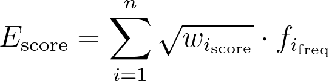

<h1>Emotional Analysis of Russian Literature</h1>

— a vector space model based program for analyzing emotions in literary texts
inspired by <a href="https://github.com/matinho13/SentiArt">Sentiart</a>.

We use a list of labels — nouns denoting the corresponding emotions, such as 
    <em>happiness</em> («schastye»), 
    <em>contentment</em> («udovolstvie»), 
    <em>surprise</em> («udivleniye»), 
    <em>anger</em> («zlost'»), 
    <em>sadness</em> («grust'»), 
    <em>fear</em> («strakh»), 
    <em>disgust</em> («otvrashcheniye»), and 
    <em>shame</em> («styd») to calculate the emotional values.
    For each word in the given text, the semantic proximity to each label is determined based on the cosine distance using the model <em>fastText Skipgram</em> (trained on Russian National Corpus).

 Words whose proximity to the label exceeded the threshold value considered semantic associates 
    => emotional lexis lists with weights.
    

Here's how we calcilate the emotional score for the whole text:

<strong>Possible applications:</strong> 
<ul>
    <li>
        Analysis of the lexis associated with each of the emotions;
    </li>
    <li>
        Analysis of the distribution of emotional lexis across stories
    </li>
</ul>

<strong>Publications:</strong> 

Moskvina, A., Kirina M. (2023). Where Is Happily Ever After? A Study of Emotions and Locations in Russian Short Stories of 1900-1930. In <em>Proceedings of Computational Linguistics – CompLing 2023</em> (in print).

<strong>Acknowledgements:</strong> 
The research is a part of project <em>«Text as big data: the modeling of convergent processes in language and speech by computational methods»</em>  within the Basic Research Program at HSE University in 2023.